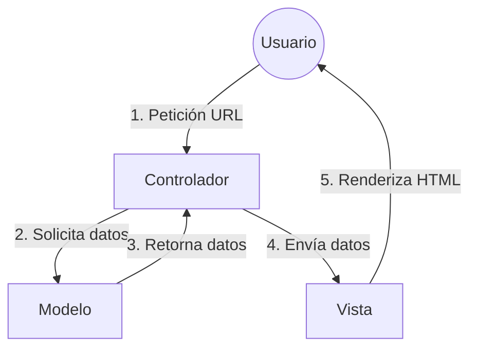

## El patrón Modelo-Vista-Controlador (MVC) en Laravel

El patrón **MVC** es la arquitectura que utiliza Laravel para separar la lógica de negocio de la interfaz de usuario. Esta división permite que el código sea más organizado, mantenible y escalable.

---

### 🧱 Los Tres Pilares del MVC

| Componente | Responsabilidad | Ubicación típica |
| :--- | :--- | :--- |
| **Modelo (Model)** | Gestiona los **datos** y la lógica de negocio. Interactúa con la base de datos (CRUD). | `app/Models/` |
| **Vista (View)** | Presenta la **interfaz** al usuario. Usa HTML y el motor de plantillas Blade. | `resources/views/` |
| **Controlador (Controller)** | El **intermediario**. Recibe la petición, consulta al Modelo y elige qué Vista mostrar. | `app/Http/Controllers/` |

---

### 🔄 Flujo de Trabajo en Laravel

Cuando un usuario interactúa con la aplicación, se sigue este proceso lógico:

1.  **Solicitud:** El usuario realiza una petición mediante una URL.
2.  **Controlador:** El enrutador redirige la petición al Controlador. Este procesa la lógica y pide datos al Modelo si es necesario.
3.  **Modelo:** Consulta la base de datos y devuelve la información al Controlador.
4.  **Respuesta:** El Controlador envía los datos a la Vista, que genera el HTML final para el usuario.

---

### 📊 Diagrama de Interacción



---

### 💡 Conclusión: La Separación de Responsabilidades

A partir de ahora, abandonamos la práctica de mezclar lógica y diseño en un mismo archivo.

> **Regla de oro:** El código PHP complejo reside en el **Controlador**, mientras que el etiquetado HTML reside exclusivamente en las **Vistas**. Esta separación es lo que hace a Laravel un marco de trabajo profesional.

```